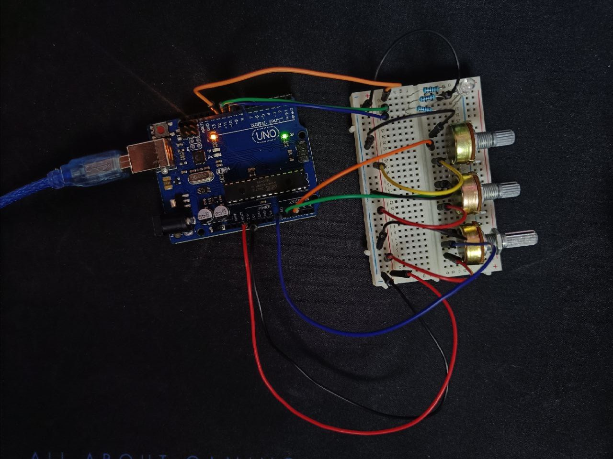
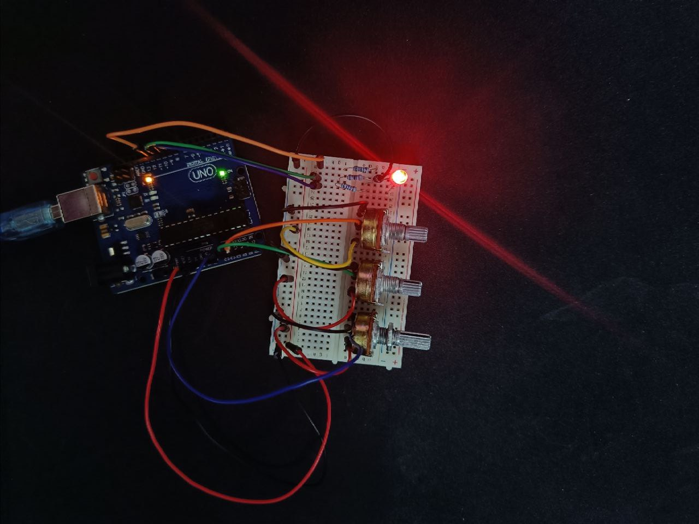
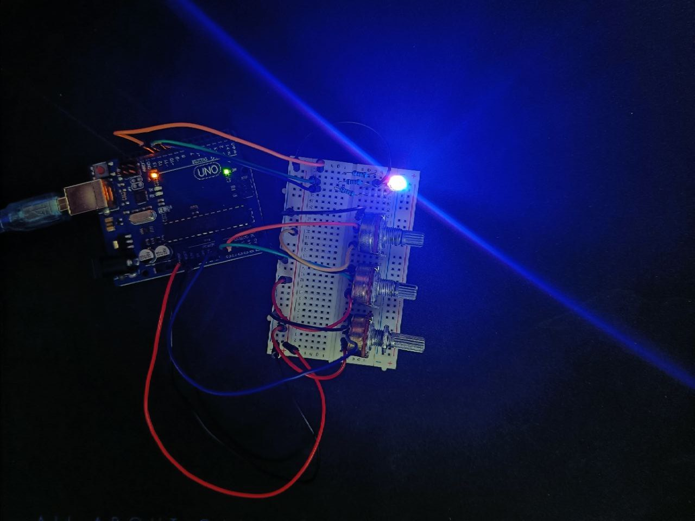

# Homework 1 - RGB LED

Control the color of an RGB LED by reading the analog brightness level using a separate potentiometer for each RGB color and mapping them to analog write values, used to output to the LED via the PWM pins. The control is done with digital electronics.

## Pictures of the setup

Led off

Led on, red at maximum brightness

Led on, red and blue at maximum brightness to get purple

## Video showcasing the setup

