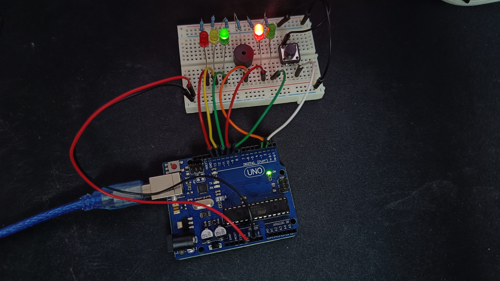
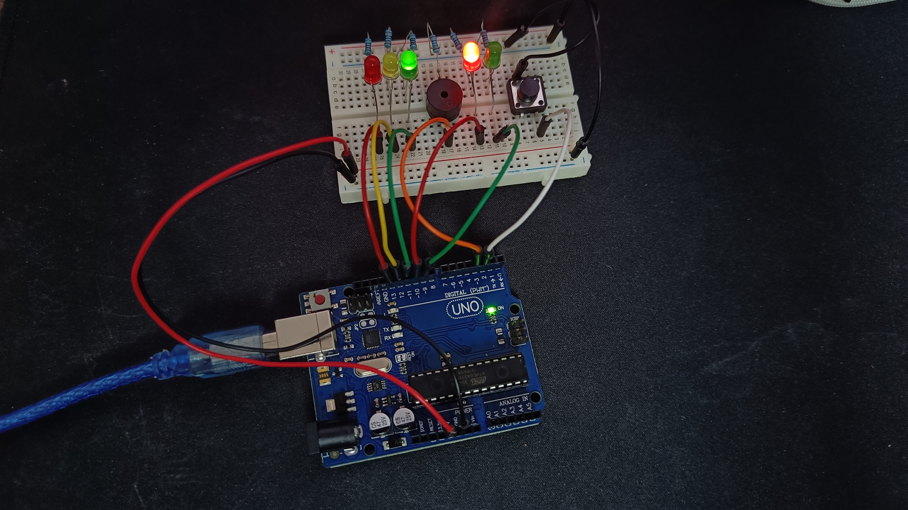

# Homework 2 - Traffic lights for a crosswalk

Build the traffic lights for an intersection.

The intersection has 2 semaphores, one for cars (red, yellow and green) and one for people (red and green) and obviously the 2 semaphores can't be green at the same time. The intersection needs to have a way to accommodate blind people.

The states of the intersection are described in more detail below.

- In the initial state the car semaphore is always green without a timer to go red and the people semaphore is red. The people have access to a button for asking their semaphore to light green, allowing them to cross.
  To prevent accidents, after pressing the button there is a timeout before changing traffic lights;
  Pressing the button more than once won't trigger the light change again, and pressing it outisde the previous state described won't trigger any action.

- After the timeout the car semaphore turns yellow for a short time to anounce the cars to stop for the changing in light

- And finally the people semaphore turns green and they can traverse the intersection. There is also a buzzer to play a sound for blind people to know when it's safe to cross.

- After some time the people semaphore starts blinking green and the beeping sound from the buzzer becomes faster to anounce the people that the semaphore will go red again and to hurry in crossing

- After that the intersection comes back to the initial state, green for cars and red for people, until other person presses the button again and the cycle repeats

## Implementation

There are 2 implementations:

- [one with manual checking if the button is pressed](./homework_2.ino)
- [one using interrupts to check if the button is pressed](./homework_2_with_interrupt.ino)

## Pictures of the setup

## Video showcasing the setup

