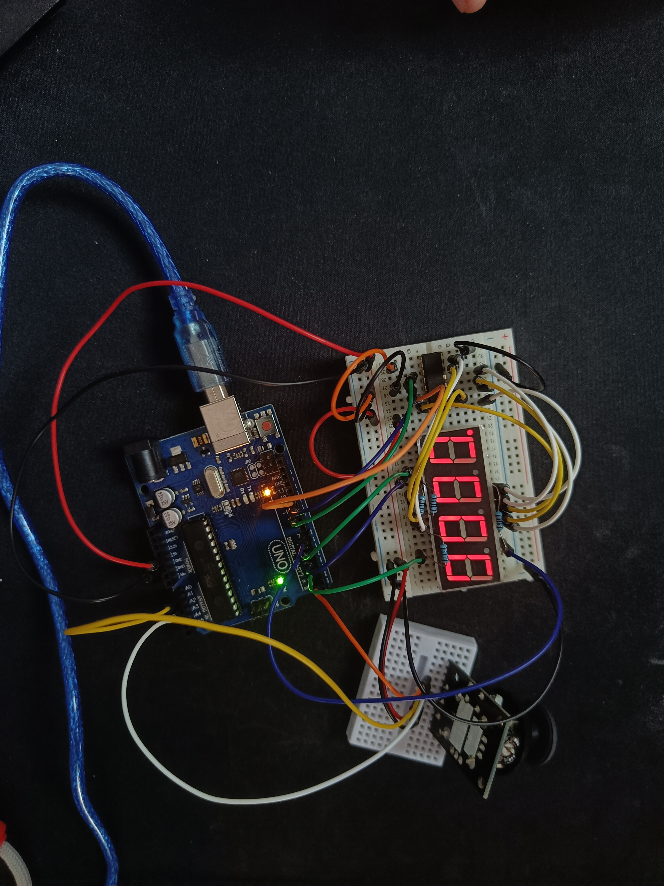
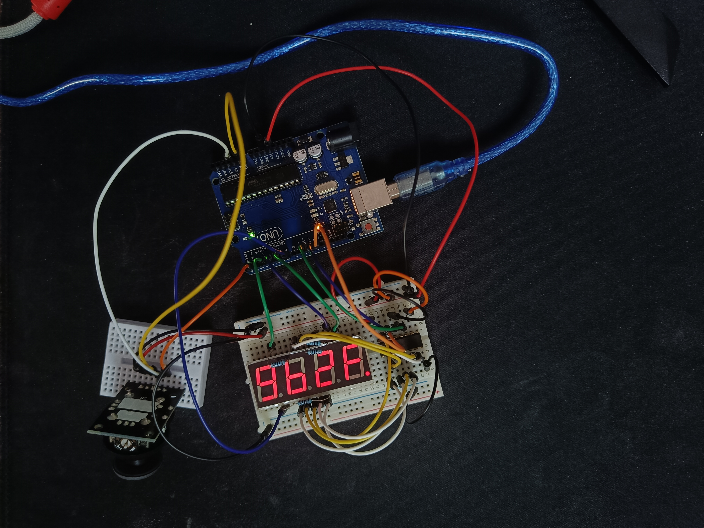

# Homework 4 - 4 digit 7-segment display & 74hc595 shift register

Program that controls the hex number on a 4 digit 7-segment display, where each display will represent a hex digit. The hardware uses a 74hc595 shift register (serial to parallel shifting-out register) to connect the arduino to the display for using less arduino pins. The shift register adds a little deplay, but for this usecase we will consider it negligible. For choosing and updating the value of a digit display we will use a joystick.

The system has 2 states: one for selecting the digit display and one for updating the value of the selected digit display.

The initial state of the system is the one for choosing the digit display to modify. The init hex number on the disoplay is 0000. The selected digit display is the rightmost one (considered as index 0). To mark which display is currently selected(hovered) the dp led on the digit display is set to blinking. Using the joystick (on x-axis) the user can move to its neighbors.

Pressing a short time on the joystick switch the user can lock the selected digit display and change the system state to the one for updating the hex value of the selected digit display. The dp is set to be always on to mark the new state. Using the joystick (on y-axis this time) the user can change the hex value(from 0 to F) displayed on the digit. At each joystick move the value is either incremented or decremented by 1, based on the direction of the y-axis. Trying to increment on F, or decrement on 0, won't trigger any overflows, and remain at the hex limit value. To save the desired value, the user can press the joystick switch again (no pressing time requirements). The hex value of digit display will be saved and the system state will change back to selecting a digit display,

The user can reset the number on the 4 digit 7-segment display by long pressing the joystick switch (only) in the first state. The action will reset the value on the display back to 0000, and move the selected digit display to the rightmost one (digit display with index 0).

To display different values on each digit display on the 4 digit 7-segment display, we will use multiplexing. To avoid changing the displayed value to fast and causing overlays on a display from other displays we will use a small delay after each activation of a display. Using a delay to big, will cause flickering.

## Pictures of the setup

## Video showcasing the setup

