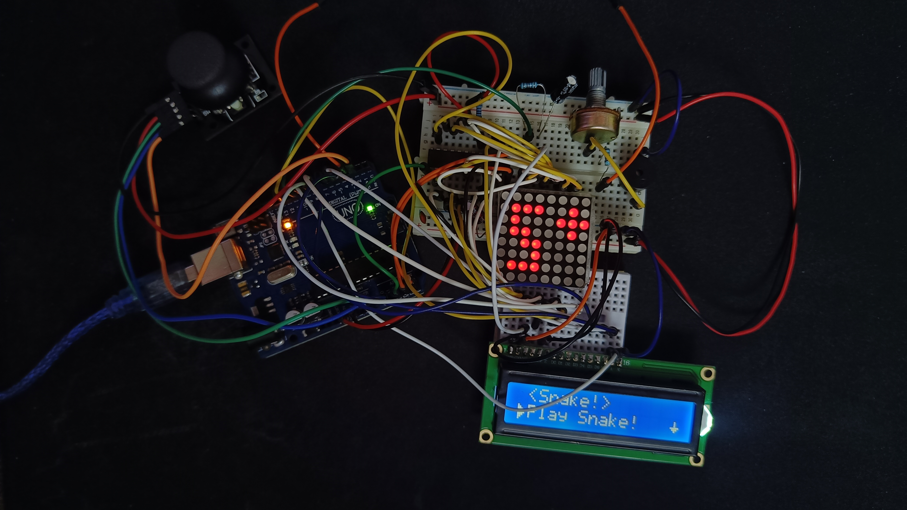

# Homeworh 5 - Game menu

Program that controls a game menu. The menu has 5 sections: play game, highscores, settings, about and how to play.

When starting the program there will be an intro message with a theme song (if sound is on in stored settings).

The user can navigate through the menu using the joystick.

The selected option is marked with an arrow pointing to it on the second row of the LCD display. The user can select an option by pressing the joystick switch.

- The play menu will go in a state for playing the game and showing some info about the status of user's game. After the game ending the user will be presented it's status vs the highscores board, what score he achieved and on what difficulty. He can press the SW button to go back to the main menu.

- The highscores menu will showcase the first highest 5 scores obtained at this game. The default values will be 0 achieved by 'NO ONE'.

- The settings menu will have submenus for changing the name, adjusting the LCD contrast & brightness, matrix brightness, game difficulty, option to reset the highscores and option to turn on/off the sound of the game. All the settings are perserved in the EEPROM.

- The about menu contains the name of the game, who developed it (spoiler: me :)) and the github username to go an check this project or other projects made by me.

- The how to play menu contains a short description of the game and how to play it.

For each main menu section will be displayed a different symbol on the 8x8 led matrix.

## Pictures of the setup

## Video showcasing the setup

